# 模糊控制基础
基于模糊数学，用于模拟人的决策。主要涉及：模糊集合论、模糊语言和模糊逻辑。
1. **论域**：被讨论的全体元素的集合。
2. 特征函数：
3. 模糊集合定义：论域$X$上的模糊集合$\widetilde{A}$由隶属度函数$\mu_\lambda(x)$来表征。
4. 模糊集合运算：
    - 并运算：$\mu_{\widetilde{A}\cup \widetilde{B}}(x)=\max(\mu_{\widetilde{A}}(x), \mu_{\widetilde{B}}(x))$
    - 交运算：$\mu_{\widetilde{A}\cap \widetilde{B}}(x)=\min(\mu_{\widetilde{A}}(x), \mu_{\widetilde{B}}(x))$
    - 补运算：$\mu_{\widetilde{A}^c}(x)=1- \mu_{\widetilde{A}(x)}$
    - 模糊集合不满足互补律
    - 代数积：$\mu_{\widetilde{A}\cdot \widetilde{B}}(x)=\mu_{\widetilde{A}}(x) \cdot \mu_{\widetilde{B}(x)}$
    - 代数和：$\mu_{\widetilde{A}+ \widetilde{B}}(x)=\mu_{\widetilde{A}}(x) + \mu_{\widetilde{B}(x)} $ 和大于1时取1
    - 环和：$\mu_{\widetilde{A}\oplus \widetilde{B}}(x)=\mu_{\widetilde{A}}(x) + \mu_{\widetilde{B}(x)} -\mu_{\widetilde{A}}(x) \cdot \mu_{\widetilde{B}(x)}$
    - 

# 模糊控制器设计
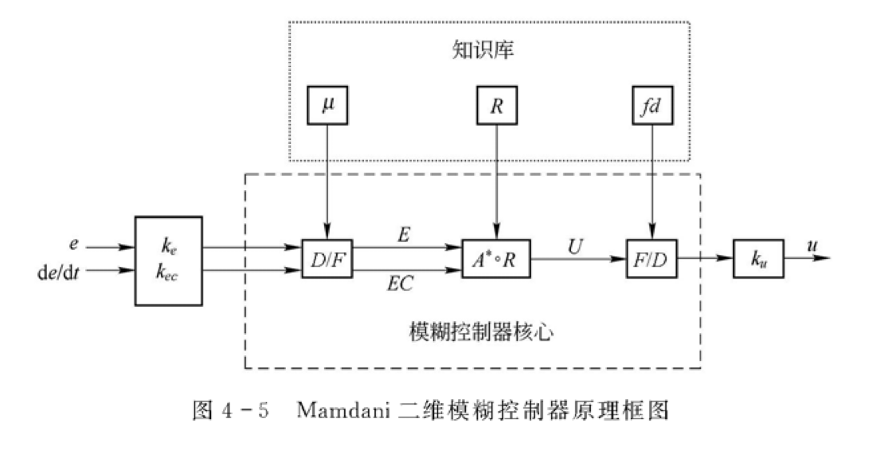
1. 量化因子
在模糊化(D/F)变换中，将物理论域X映射到模糊论域N，要使输入量变化后落入模糊论域中，从而使模糊控制器核心不变。
$$k_j=n_j/x_j$$
其中，输入变量$x_1$的一个分量$x_j$的物理论域$X_j=[-x,x](x>0)$，其模糊论域$N_j=[-n_j,n_j](n_j>0)$
1. 比例因子
在清晰化(F/D)变换中，将模糊论域N映射到物理论域X，要使输入量变化后落入物理论域中，从而使模糊控制器核心不变。
$$k_n=u/n$$
其中，后面机构要求输入的控制量$u$的物理论域$U=[-u,u](u>0)$
1. 模糊化
模糊子集一般3～10个                                                                                                   
**模糊子集**：
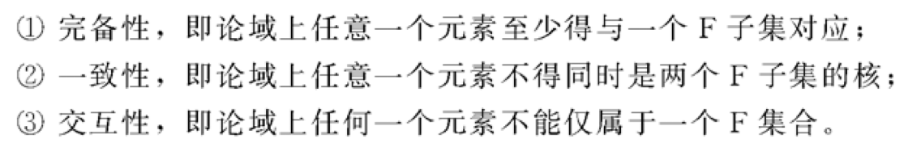
**隶属函数的选取**：
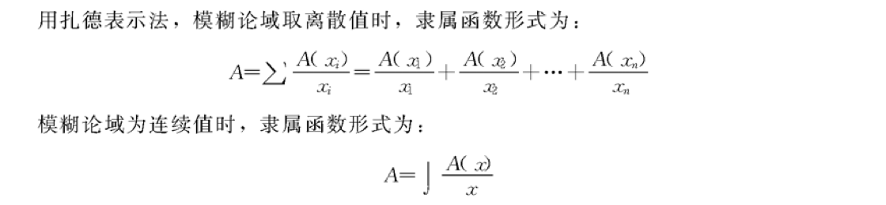
实用中，远离系统状态平衡点，偏差较大时可用低分辨率隶属函数；接近平衡点，偏差较小时，可用高分辨率隶属函数。
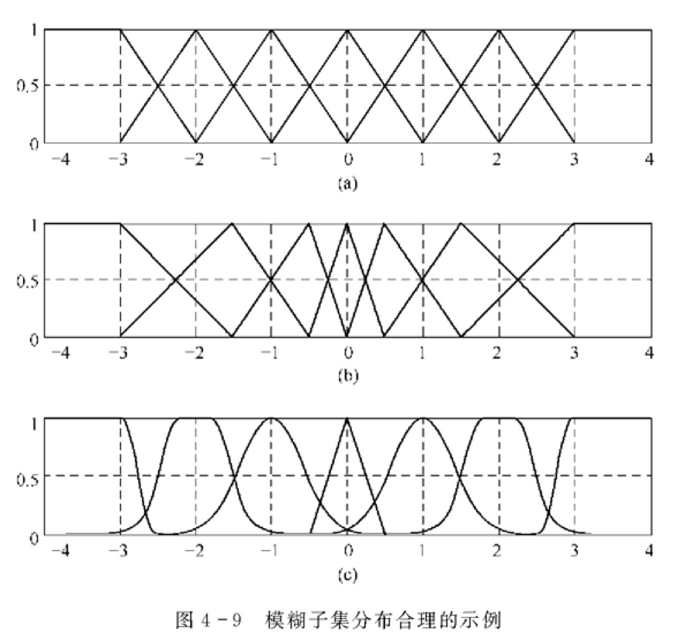
1. 清晰化
    - 面积中心（重心）法(centroid)：求出模糊集合隶属函数曲线和横坐标包围区域面积的中心，选这个中心对应的横坐标，作为这个模糊集合的代表值。                                                                    
    - 面积平分法(bisector)：先求出模糊集合隶属函数曲线和横坐标包围区域的面积，再找出将该面积等分成两份的平分线对应的横坐标值，用该值代表模糊集合。
    - 最大隶属度法(maximum)：用隶属度最大点对应的元素值代表。
        - 平均值法(mom)：若有多个点都取最大隶属值，则取这些点的平均值$u_mom$的横坐标作为代表。
        - 最大值法(lom)：若多个点，则取最大值。
        - 最小值法(som)：若多个点，则取最小。
2. 模糊控制规则
模糊控制的核心，相当于传统控制理论中的校正装置或补偿器（pid）。生成方法大致有两种：一种是基于专家经验和知识；一种是对系统进行测试实验，从分析系统的输入输出数据中，归纳总结得到的。
   - 语言型模糊规则：由一系列的模糊条件语句组成的，即由许多”If … then...”构成，由经验得到
    - 表格型模糊规则
    - 用测试数据生成模糊控制规则表（模糊控制及其MATLAB仿真P105）

# 用模糊控制器调节PID控制器参数
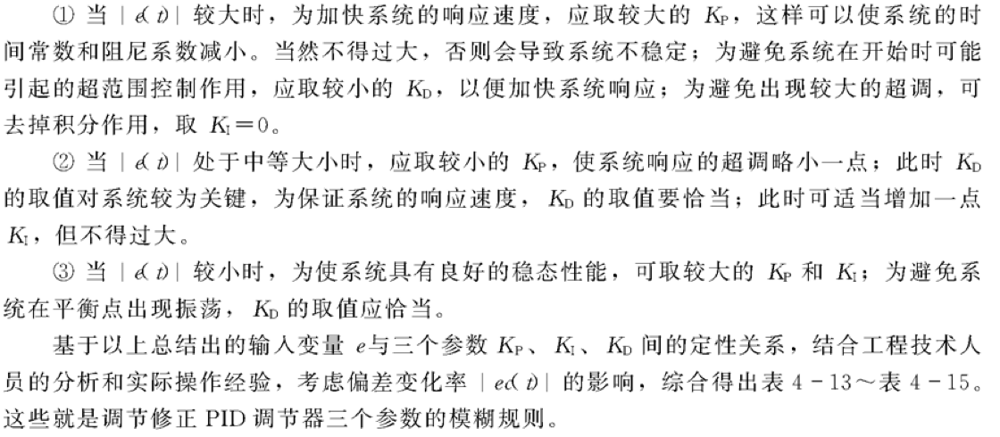

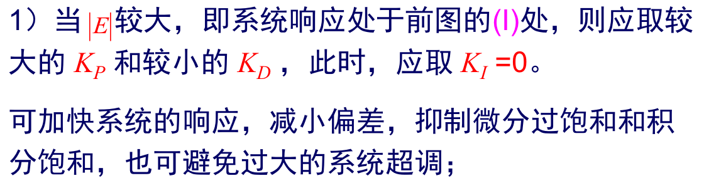

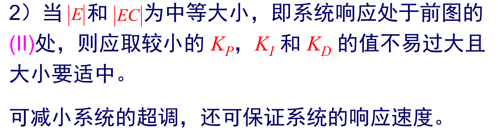
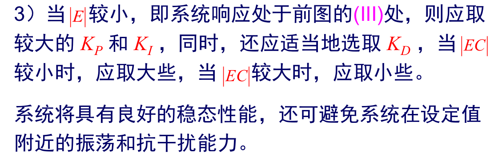
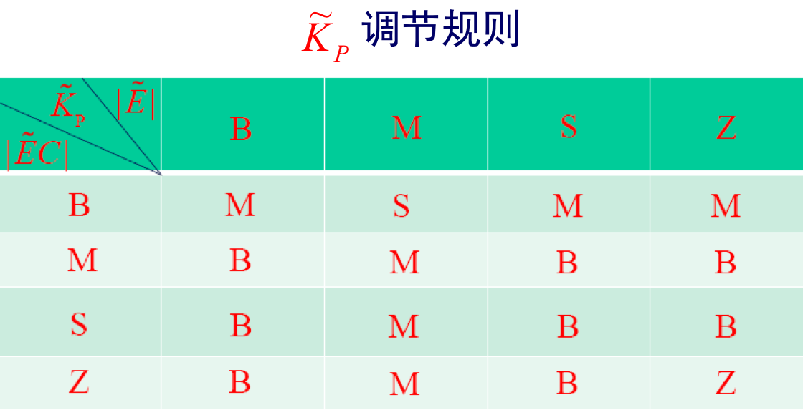
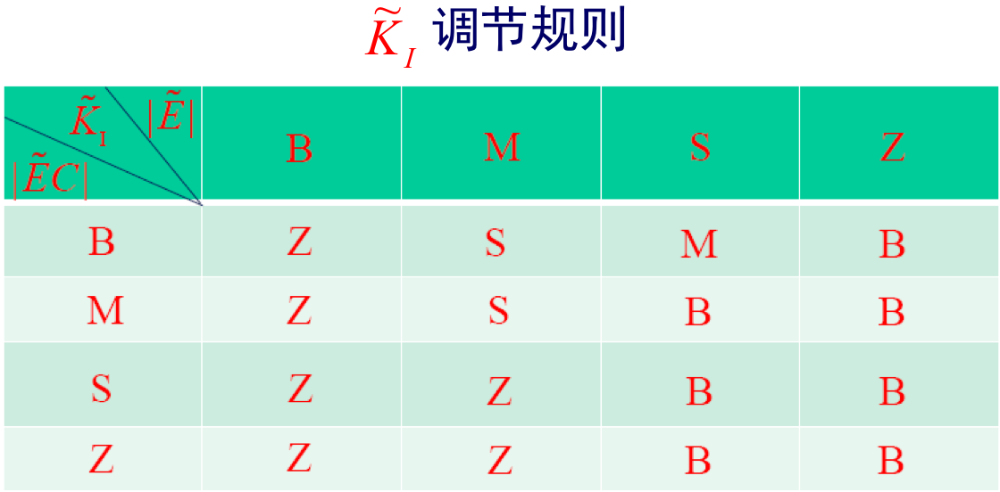
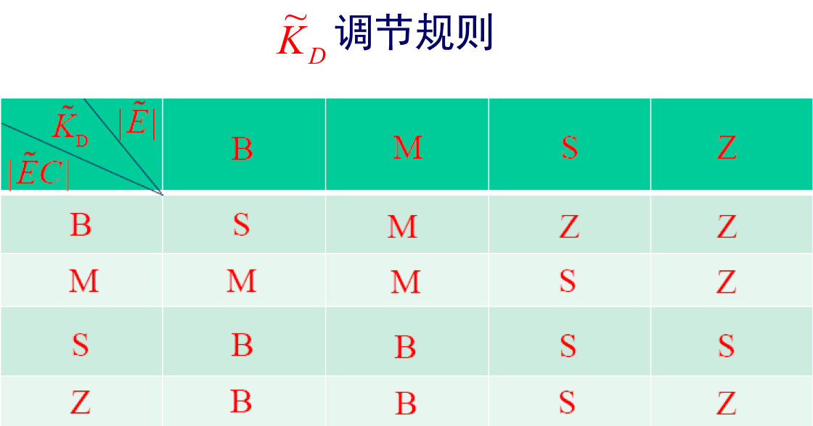

